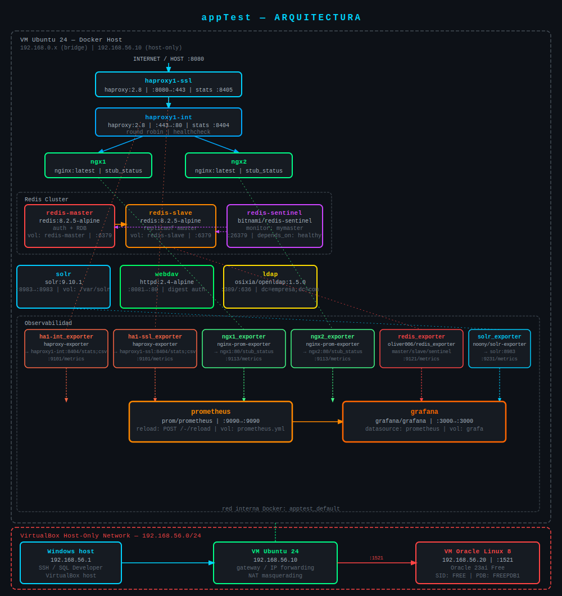

# MICROs to DOCKER


## Alcance

_Migración de una arquitectura de microservicios Java a Docker. El objetivo es reemplazar las máquinas virtuales actuales por contenedores._

## Cómo levantar el ambiente

Parado en la carpeta **appTest**, ejecutar `docker compose up -d`. Para bajarlo, `docker compose down`.

## Estructura de archivos

Cada componente tiene su propia carpeta con un **Dockerfile** y su archivo de configuración. El **docker-compose.yml** está en la raíz y orquesta todos los servicios.

## Volúmenes

Los archivos de configuración se montan como bind mounts. Los datos persistentes se almacenan en named volumes administrados por Docker.

---

## HAProxy

Se crearon dos instancias de HAProxy basadas en la imagen **haproxy:2.8**. Cada una tiene su propio Dockerfile y archivo haproxy.cfg montado via bind mount.

**haproxy1-ssl**: recibe el tráfico externo en el puerto **443** y lo reenvía al HAProxy interno.

**haproxy1-int**: recibe el tráfico del SSL por el puerto **80** y lo balancea entre los servicios Java usando round robin.

**java1 y java2**: contenedores nginx que simulan los servicios Java reales, accesibles solo dentro de la red interna de Docker.

---

## Redis cluster

Se configuró un cluster de Redis compuesto por tres servicios:

**redis-master**: imagen **redis:8.2.5-alpine**, configurado con autenticación, persistencia RDB en named volume **redis-master** y bind en **0.0.0.0:6379**.

**redis-slave**: imagen **redis:8.2.5-alpine**, replica al master via directiva `replicaof redis-master 6379`, persistencia RDB en named volume **redis-slave**.

**redis-sentinel**: imagen **bitnami/redis-sentinel:latest**. Se descartó usar **redis:8.2.5-alpine** con **sentinel.conf** debido a un bug en Redis 8 donde el hostname del master se resuelve durante la lectura del archivo de configuración, antes de que la red de Docker esté disponible. La imagen de Bitnami resuelve esto configurando el sentinel via variables de entorno. El sentinel monitorea al master bajo el alias `mymaster` y tiene configurado `depends_on` con `condition: service_healthy` para garantizar que master y slave estén listos antes de arrancar.

---

## Solr

Se agregó el servicio Solr basado en la imagen **solr:9.10.1**. Se eligió esta versión por sobre la 10.0.0 siguiendo el criterio de no migrar y actualizar simultáneamente.

El servicio expone el puerto **8983** hacia la máquina host, donde está disponible la interfaz de administración web. Los datos se persisten en un named volume montado en **/var/solr** dentro del contenedor.

Se creó un core de prueba llamado **test** usando el comando:

```bash
docker exec -it solr solr create_core -c test
```

Se verificó que el core persiste correctamente ante reinicios del contenedor mediante `docker compose stop solr` y `docker compose start solr`.

---

## WebDAV

Servidor de archivos compartidos sobre HTTP usando Apache HTTP Server con `mod_dav`.

**Imagen base:** `httpd:2.4-alpine`  
**Puerto:** `8081→80`

**Volúmenes:**
- `webdav` → `/usr/local/apache2/htdocs/`
- `webdav-up` → `/usr/local/apache2/uploads/`

**Estructura de archivos:**
```
webdav/
    Dockerfile
    httpd.conf
    httpd-dav.conf
    user.passwd
```

**Módulos Apache habilitados en `httpd.conf`:**
```
LoadModule dav_module modules/mod_dav.so
LoadModule dav_fs_module modules/mod_dav_fs.so
LoadModule dav_lock_module modules/mod_dav_lock.so
LoadModule auth_digest_module modules/mod_auth_digest.so
LoadModule socache_dbm_module modules/mod_socache_dbm.so
```

**Notas importantes:**
- Se usa `httpd-dav.conf` para configurar el endpoint `/uploads` con autenticación Digest.
- Se requiere instalar `apr-util-dbm_gdbm` vía `apk` porque la imagen Alpine no incluye el driver DBM necesario para `DavLockDB`.
- El archivo `user.passwd` se genera con `htdigest` dentro del contenedor y se copia al proyecto.

**Cómo regenerar `user.passwd`:**
```bash
docker exec -it webdav htdigest -c /usr/local/apache2/user.passwd DAV-upload admin
docker cp webdav:/usr/local/apache2/user.passwd ./webdav/
```

**Verificar que WebDAV funciona:**
```bash
curl -v -X OPTIONS http://localhost:8081/uploads/
# Debe mostrar: PROPFIND, PROPPATCH, COPY, MOVE, LOCK, UNLOCK, DELETE

curl -v -T archivo.txt --digest -u admin:password http://localhost:8081/uploads/
# Debe responder: 201 Created
```

---

## LDAP

Servidor de directorio centralizado de usuarios basado en OpenLDAP. Permite autenticación y autorización centralizada para todos los servicios de la plataforma.

**Imagen:** `osixia/openldap:1.5.0`

No existe imagen oficial en Docker Hub para OpenLDAP. La imagen de Bitnami fue discontinuada. Se utilizó `osixia/openldap` por ser la más mantenida y documentada de la comunidad.

**Variables de entorno:**

| Variable | Descripción |
|---|---|
| `LDAP_ROOT` | Sufijo base del directorio. Ej: `dc=empresa,dc=com` |
| `LDAP_ADMIN_USERNAME` | Usuario administrador del directorio |
| `LDAP_ADMIN_PASSWORD` | Contraseña del administrador |
| `LDAP_ORGANISATION` | Nombre de la organización raíz del árbol |

**Volúmenes:**

| Nombre | Ruta en contenedor | Descripción |
|---|---|---|
| `ldap_data` | `/var/lib/ldap` | Datos del directorio LDAP |
| `ldap_config` | `/etc/ldap/slapd.d` | Configuración del servidor slapd |

No se exponen puertos al host. El servicio es accesible únicamente dentro de la red interna Docker por nombre de contenedor (`ldap`) en los puertos `389` (LDAP) y `636` (LDAPS).

**Conceptos clave:**
- **LDAP:** protocolo para acceder a directorios de usuarios organizados en forma de árbol jerárquico.
- **Sufijo base (`dc=empresa,dc=com`):** raíz del árbol LDAP. Cada `dc=` representa un nivel del dominio.
- Los datos del directorio y la configuración del servidor se persisten en volúmenes separados para facilitar backups y migraciones.

---

## Dependencias de arranque (depends_on)

Al agregar LDAP al proyecto, el orden de arranque de los contenedores cambió y comenzaron a aparecer errores de resolución de nombres en los HAProxy:

- `haproxy1-int` no podía resolver `java1` y `java2`
- `haproxy1-ssl` no podía resolver `haproxy1-int`

La causa es que HAProxy intenta resolver los nombres de los servidores backend al momento de leer la configuración. Si el contenedor destino no está listo, falla con `could not resolve address`.

**Solución:** se agregaron dependencias explícitas con `depends_on` en el docker-compose:

- `haproxy1-int` depende de `java1` y `java2` con `condition: service_started`
- `haproxy1-ssl` depende de `haproxy1-int` con `condition: service_healthy`

Para que `service_healthy` funcione, se agregó un healthcheck a `haproxy1-int` que valida la configuración con el propio binario de HAProxy:

```yaml
healthcheck:
  test: ["CMD", "haproxy", "-c", "-f", "/usr/local/etc/haproxy/haproxy.cfg"]
  interval: 5s
  timeout: 3s
  retries: 5
```

La imagen `haproxy:2.8` no incluye `wget` ni `curl`, por lo que no es posible hacer un healthcheck HTTP. Se usa el binario nativo como alternativa.

**Stats de HAProxy:** se habilitó el frontend de estadísticas en `haproxy1-int` en el puerto `8404`, accesible desde el host en `http://localhost:8404/stats`.

```
frontend stats
    bind *:8404
    stats enable
    stats uri /stats
```

**Conceptos clave:**
- El orden de arranque en Docker Compose sin `depends_on` es no determinista.
- `service_started` alcanza cuando solo necesitás que el proceso haya iniciado.
- `service_healthy` requiere que el contenedor tenga un healthcheck definido y lo pase.
- Renombrar la carpeta raíz cambia el nombre de la red y el prefijo de los contenedores — los contenedores anteriores quedan huérfanos y hay que eliminarlos manualmente.

---

## Observabilidad — Prometheus

Se incorporó un stack de observabilidad compuesto por dos contenedores: un exporter que traduce las métricas de HAProxy al formato de Prometheus, y Prometheus mismo que las recolecta.

### Conceptos clave

**Exporter:** Prometheus no puede leer métricas de cualquier servicio directamente. Necesita que estén expuestas en un endpoint HTTP con un formato específico (`/metrics`). Los servicios que no hablan ese formato necesitan un proceso intermediario llamado exporter que traduce sus métricas nativas al formato que Prometheus entiende.

**Scraping:** Prometheus funciona en modo pull — es él quien va a buscar las métricas a cada target en el intervalo configurado. Si un target no responde, lo marca como `down` y reintenta. No rompe el proceso.

**Pipeline de observabilidad:**
```
haproxy1-int (:8404/stats) → ha1-int_exporter (:9101/metrics) → prometheus (:9090)
```

### ha1-int_exporter

**Imagen:** `quay.io/prometheus/haproxy-exporter`  
**Puerto:** `9101` (solo red interna Docker)

El exporter se conecta a las stats de HAProxy y las traduce al formato Prometheus. Se configura mediante el argumento `--haproxy.scrape-uri`:

```yaml
ha1-int_exporter:
  container_name: ha1-int_exporter
  image: quay.io/prometheus/haproxy-exporter:latest
  ports:
    - "9101:9101"
  command: --haproxy.scrape-uri="http://haproxy1-int:8404/stats"
```

No requiere `depends_on` — si HAProxy no está disponible al arrancar, reintenta en el próximo ciclo.

**Verificar que el exporter expone métricas:**
```bash
curl localhost:9101/metrics
# Debe mostrar haproxy_up 1
```

La métrica clave para confirmar que el exporter llega a HAProxy es:
```
haproxy_up 1
```

### prometheus

**Imagen:** `prom/prometheus`  
**Puerto:** `9090→9090`

La configuración se monta como bind mount desde `./prome/prometheus.yml`. El volumen de datos usa el path correcto para esta imagen (`/prometheus`).

```yaml
prometheus:
  container_name: prometheus
  image: prom/prometheus
  ports:
    - "9090:9090"
  volumes:
    - "./prome/prometheus.yml:/etc/prometheus/prometheus.yml"
    - prome:/prometheus
```

**prometheus.yml:**
```yaml
global:
  scrape_interval: 15s
  external_labels:
    monitor: 'codelab-monitor'

scrape_configs:
  - job_name: 'haprox1-int'
    scrape_interval: 5s
    static_configs:
      - targets: ['ha1-int_exporter:9101']
```

**Reload en caliente** (sin reiniciar el contenedor):
```bash
curl -X POST http://localhost:9090/-/reload
```

**Verificar targets activos:**  
`http://localhost:9090/targets` — el job `haprox1-int` debe aparecer con estado `UP`.

**Notas sobre la imagen:**
- No existe Docker Official Image para Prometheus en Docker Hub. La imagen oficial la publica el propio proyecto bajo la organización `prom` (`prom/prometheus`).
- La imagen `bitnami/prometheus` fue descontinuada — no está disponible en Docker Hub.
- El path de datos de `prom/prometheus` es `/prometheus`, no `/opt/bitnami/prometheus/data`.

---

## Oracle Database 23ai Free

Oracle Database corre fuera de Docker en una VM dedicada con Oracle Linux 8.10. Esta decisión replica el modelo productivo real donde las bases de datos críticas no se contienen: requieren control total de recursos, operaciones de backup/recovery dedicadas y no se benefician del modelo efímero de los contenedores.

### Arquitectura de red

Se implementó una red segmentada usando VirtualBox Host-Only Network (`192.168.56.0/24`), replicando el concepto de red de servidores segregada típico de entornos corporativos. El servidor Oracle no tiene salida directa a internet — accede a repositorios de paquetes a través de la VM Ubuntu, que actúa como gateway/router mediante IP forwarding y NAT masquerading.

```
Windows host      192.168.56.1   (acceso SSH y SQL Developer)
VM Ubuntu 24      192.168.56.10  (Docker + gateway hacia internet)
VM Oracle Linux   192.168.56.20  (Oracle Database, sin internet directo)
```

**Conceptos aplicados:**
- **Segmentación de red / defensa en profundidad:** cada capa de la arquitectura vive en su propia red y solo se comunica con quien necesita. Oracle solo es alcanzable por el puerto 1521 desde la red interna.
- **IP forwarding:** permite que la VM Ubuntu reenvíe tráfico entre interfaces (`enp0s8` → `enp0s3`), funcionando como router.
- **NAT masquerading (iptables):** el tráfico que sale desde Oracle Linux hacia internet aparece con la IP de Ubuntu, no con la de Oracle.
- **IPs fijas:** en producción los servidores de base de datos nunca usan DHCP. Toda IP está asignada administrativamente y documentada.

### Configuración de red en VM Ubuntu (gateway)

Habilitar IP forwarding de forma persistente:
```bash
# /etc/sysctl.conf
net.ipv4.ip_forward=1
```

Reglas iptables para NAT masquerading:
```bash
sudo iptables -t nat -A POSTROUTING -o enp0s3 -j MASQUERADE
sudo iptables -A FORWARD -i enp0s8 -o enp0s3 -j ACCEPT
sudo iptables -A FORWARD -i enp0s3 -o enp0s8 -m state --state RELATED,ESTABLISHED -j ACCEPT
```

> **Nota:** las reglas de iptables no persisten ante reinicios por defecto. Para hacerlas persistentes usar `iptables-persistent`.

### Instalación de Oracle Linux 8.10

VM configurada en VirtualBox con los siguientes parámetros:

| Parámetro | Valor |
|---|---|
| RAM | 4096 MB |
| CPUs | 2 |
| Disco | 60 GB (VDI dinámico) |
| Red | Host-Only `192.168.56.20/24` |
| Gateway | `192.168.56.10` (VM Ubuntu) |
| DNS | `8.8.8.8`, `8.8.4.4` |
| Hostname | `oracle-db` |
| Software | Server (sin GUI) |

La instalación se realizó con el Full ISO de Oracle Linux 8.10 (`x86_64`). Se eligió **Server sin GUI** porque en producción los servidores de base de datos se administran exclusivamente por SSH — la GUI consume recursos que necesita Oracle y amplía innecesariamente la superficie de ataque.

### Instalación de Oracle Database 23ai Free

Oracle 23ai Free reemplaza a Oracle XE como versión gratuita. Límites: 2 CPUs, 2 GB RAM para la instancia, 12 GB de datos.

**1. Preinstall package** — configura automáticamente el sistema operativo:
```bash
dnf install -y oracle-database-preinstall-23ai
```
Crea el usuario `oracle` (uid `54321`), grupos `oinstall`, `dba`, `oper`, `backupdba`, `dgdba`, `kmdba`, `racdba`, y ajusta parámetros del kernel requeridos por Oracle.

**2. Instalación del motor:**
```bash
dnf install -y https://download.oracle.com/otn-pub/otn_software/db-free/oracle-database-free-23ai-1.0-1.el8.x86_64.rpm
```

**3. Inicialización de la base de datos:**
```bash
/etc/init.d/oracle-free-23ai configure
```
Crea la instancia, los archivos de datos y el diccionario de datos. Solicita contraseña para `SYS`, `SYSTEM` y `PDBADMIN`.

**4. Variables de entorno del usuario oracle** (`~/.bash_profile`):
```bash
export ORACLE_HOME=/opt/oracle/product/23ai/dbhomeFree
export ORACLE_SID=FREE
export PATH=$PATH:$ORACLE_HOME/bin
```

**5. Habilitado como servicio:**
```bash
systemctl enable oracle-free-23ai
```

**6. Apertura del firewall:**
```bash
firewall-cmd --permanent --add-port=1521/tcp
firewall-cmd --reload
```

### Información de la instancia

| Parámetro | Valor |
|---|---|
| SID | `FREE` |
| CDB (Container Database) | `FREE` |
| PDB (Pluggable Database) | `FREEPDB1` |
| Puerto listener | `1521` |
| String de conexión (PDB) | `oracle-db/FREEPDB1` |

### Verificación

```bash
# Estado del servicio
/etc/init.d/oracle-free-23ai status

# Conectarse como SYSDBA
su - oracle
sqlplus / as sysdba

# Verificar estado de la instancia
SELECT status FROM v$instance;

# Verificar PDB
SELECT name, open_mode FROM v$pdbs;
```

Verificar conectividad desde Windows (PowerShell):
```powershell
Test-NetConnection -ComputerName 192.168.56.20 -Port 1521
```

Verificar conectividad desde Ubuntu:
```bash
curl -v telnet://192.168.56.20:1521
```

---

## Registro de puertos e IPs

### VMs e infraestructura

| Host | IP | Rol |
|---|---|---|
| Windows host | `192.168.56.1` | Acceso SSH y administración |
| VM Ubuntu 24 | `192.168.0.x` (bridge, DHCP) | Docker host, internet |
| VM Ubuntu 24 | `192.168.56.10` (host-only, fija) | Gateway para Oracle |
| VM Oracle Linux 8 | `192.168.56.20` (host-only, fija) | Oracle Database 23ai Free |

### Contenedores Docker

| Contenedor | Puerto host | Puerto contenedor | Descripción |
|---|---|---|---|
| `haproxy1-ssl` | `8080` | `443` | HTTPS externo (SSL termination) |
| `haproxy1-int` | `443` | `80` | Balanceo interno round-robin |
| `haproxy1-int` | `8404` | `8404` | HAProxy stats |
| `java1` | — | — | Solo red interna Docker |
| `java2` | — | — | Solo red interna Docker |
| `redis-master` | — | `6379` | Solo red interna Docker |
| `redis-slave` | — | `6379` | Solo red interna Docker |
| `redis-sentinel` | — | `26379` | Solo red interna Docker |
| `solr` | `8983` | `8983` | Panel admin Solr |
| `webdav` | `8081` | `80` | WebDAV HTTP |
| `ldap` | — | `389 / 636` | Solo red interna Docker |
| `ha1-int_exporter` | — | `9101` | Exporter HAProxy → Prometheus |
| `prometheus` | `9090` | `9090` | Recolección de métricas |

### Servicios externos (fuera de Docker)

| Servicio | Host | Puerto | Protocolo |
|---|---|---|---|
| Oracle Database 23ai Free | `192.168.56.20` | `1521` | TCP (TNS) |

---


